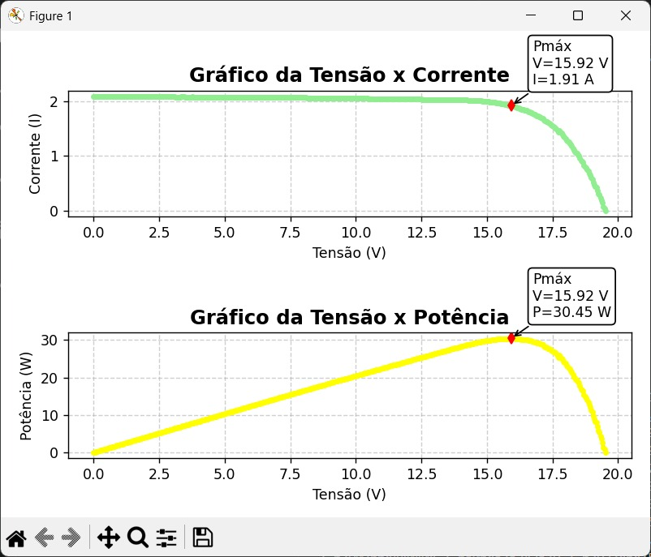

# ☀️ Maximum Power Point Tracking (MPPT) Analysis

Aplicação desenvolvida em Python para análise de curvas características de um módulo fotovoltaico e determinação do Ponto de Máxima Potência (MPP) utilizando o algoritmo Perturb and Observe (P&O).

O projeto foi desenvolvido como atividade acadêmica da disciplina **Introdução a Python em Engenharia**, com o objetivo de aplicar conceitos de programação, processamento numérico e visualização de dados na análise de sistemas fotovoltaicos.

---

## Objetivo

Desenvolver uma aplicação capaz de calcular o Ponto de Máxima Potência (MPP) de um módulo fotovoltaico a partir de dados experimentais de tensão e corrente, apresentando os resultados em gráficos e destacando automaticamente o ponto de operação de máxima potência.

---

## Funcionalidades

- Entrada de dados de tensão e corrente
- Cálculo automático da potência elétrica
- Implementação do algoritmo Perturb and Observe (P&O)
- Determinação do Ponto de Máxima Potência (MPP)
- Geração da curva Tensão × Corrente (I-V)
- Geração da curva Tensão × Potência (P-V)
- Destaque visual do ponto de máxima potência nos gráficos

---

## Tecnologias

- **Python** — Linguagem principal
- **NumPy** — Processamento numérico
- **Matplotlib** — Geração de gráficos científicos

---

## Conceitos Aplicados

- Energia Solar Fotovoltaica
- Maximum Power Point Tracking (MPPT)
- Algoritmo Perturb and Observe (P&O)
- Processamento Numérico
- Análise de Dados
- Visualização Científica
- Curvas I-V e P-V
- Engenharia Elétrica
- Programação Científica em Python

---

## 📂 Estrutura do Projeto

```text
python-mppt-analysis/
│
├── src/
│   └── mppt.py                  # Código principal (MPPT P&O)
├── images/
│   └── mppt_curvas_iv_pv.jpeg   # Resultado: curvas I-V e P-V
├── README.md
├── LICENSE
├── requirements.txt
└── .gitignore
```

---

## ▶️ Instalação

### Pré-requisitos

- [Python 3.10 ou superior](https://www.python.org/downloads/)
- [Git](https://git-scm.com/)

### Passo a passo

1. Clone este repositório

```bash
git clone https://github.com/RebekaLima-eng/python-mppt-analysis.git
```

2. Entre na pasta do projeto

```bash
cd python-mppt-analysis
```

3. Crie e ative um ambiente virtual

```bash
# Windows
python -m venv venv
venv\Scripts\activate

# Linux/macOS
python3 -m venv venv
source venv/bin/activate
```

4. Instale as dependências

```bash
pip install -r requirements.txt
```

---

## ▶️ Uso

Execute o programa a partir da raiz do projeto:

```bash
python src/mppt.py
```

O programa solicitará duas listas separadas por vírgula:

1. Os valores de **tensão (V)** para a curva I-V;
2. Os valores de **corrente (A)** correspondentes.

Em seguida, exibe o ponto de máxima potência encontrado pelo algoritmo P&O:

```text
Ponto de Máxima Potência (P&O):
V = 16.50 V
I = 2.85 A
P = 47.03 W
```

Por fim, abre uma janela com os gráficos **Tensão × Corrente** e **Tensão × Potência**, destacando o MPP com um marcador vermelho e uma anotação com os valores.

---

## 📊 Resultados

O programa realiza:

- Cálculo da potência para cada ponto da curva
- Identificação automática do MPP
- Exibição dos valores de tensão, corrente e potência máxima
- Geração de gráficos I-V e P-V com destaque para o ponto de máxima potência



---

## Competências Desenvolvidas

- Programação em Python
- Computação Científica
- Manipulação de Arrays com NumPy
- Visualização de Dados com Matplotlib
- Desenvolvimento de Algoritmos
- Análise de Sistemas Fotovoltaicos
- Organização de projetos em Python

---

## 📄 Licença

Este projeto está licenciado sob a licença Apache 2.0.

---

## Autor

**Rebeka Raquel Costa Lima**

Graduanda em Engenharia de Controle e Automação – UFPE
